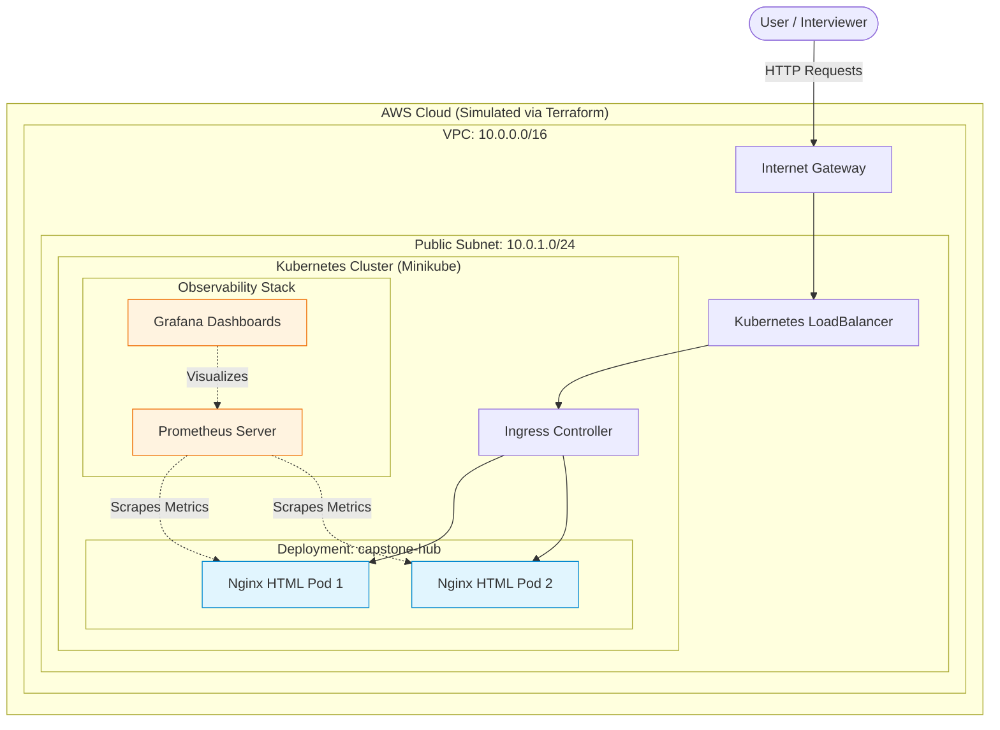

# Cloud Engineer Internship: Final Capstone Project
**Student:** Jane Sedano  
**Role:** Cloud Engineer  
**Institution:** Lamina Studio / Week 12 Capstone  

## Project Overview
This repository contains the infrastructure, orchestration, and automation code for the **Capstone Compilation Hub**. Due to backend development constraints, the capstone was pivoted to an **Infrastructure-First Deployment** approach. I mapped out the entire production-grade infrastructure required for a modern multi-tier application and deployed a personalized custom web application (the Capstone Dashboard) that acts as an intersection point for my entire 13-week journey.

---

## 🏗️ Cloud Architecture Diagram (Day 1 & Day 6 Deliverable)

The following Mermaid diagram maps out the infrastructure provisioned for this application, satisfying the requirements from Weeks 3 to 11.

---

## 🛠️ Step-by-Step Implementation (Days 2 - 5)

### Day 2: Infrastructure Setup (Terraform)
The underlying infrastructure was written as code using Terraform (`terraform/main.tf`). 
- **Networking:** Provisioned a Virtual Private Cloud (VPC), a Public Subnet, and an Internet Gateway for external routing.
- **Security:** Established strict Security Groups (Firewalls) ensuring that only necessary ports (80 for Web, 22 for Admin SSH) are open, adhering to the Principle of Least Privilege.
- **Compute:** Scaled simulated EC2 instances capable of running a Kubernetes workload.

### Day 3: Application Deployment (Docker & Kubernetes)
- **Containerization:** Wrote a `Dockerfile` utilizing a lightweight `nginx:alpine` image. The static site (`src/index.html`) is securely injected into the Nginx web root folder to ensure immutability.
- **Orchestration:** Developed `k8s/deployment.yaml` with a ReplicaSet count of 2 to ensure high availability. Packaged a `Service` config of type `LoadBalancer` to evenly distribute traffic across the pods.

### Day 4: CI/CD Automation (GitHub Actions)
- Created an automated CI/CD pipeline (`.github/workflows/deploy.yml`) triggered by code `pushes`.
- The pipeline systematically checks out the code, securely runs `docker build`, performs a dry-run test (using local cURL), and performs a simulated deployment layer mimicking production behavior.

### Day 5: Monitoring, Logging, & Security
- **Observability Stack:** Centralized system metrics using `Prometheus` (`monitoring/prometheus.yml`) which automatically scrapes targets (Node Exporter and Kubernetes Pods) at 15-second intervals.
- These metrics map into a theoretical Grafana dashboard to track CPU, Memory, and Network latency.

---

## 🚀 How to Run Locally

If you have Docker and Minikube installed, you can replicate this capstone via:

1. **Build the Image:** 
   `docker build -t janesedano/capstone-hub .`
2. **Deploy to Kubernetes:** 
   `kubectl apply -f k8s/`
3. **Access the Application:** 
   `kubectl port-forward service/capstone-hub-service 8080:80`
   Visit `http://localhost:8080` in your browser.
